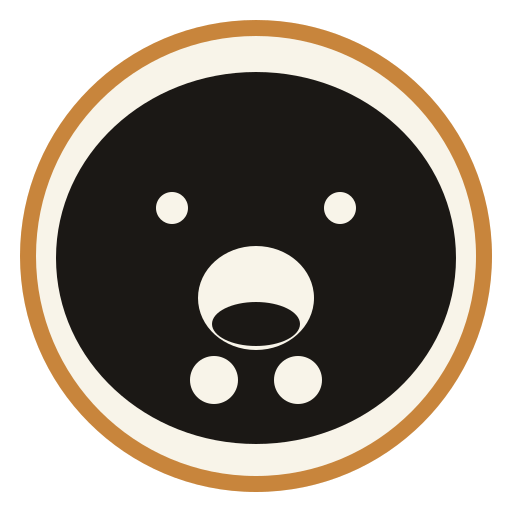

<div align="center">



# 🐼 Panda Wok

**Asian cloud kitchen · Alexandria, Egypt** — Wok · Ramen · Sushi · Izakaya, crafted to order.

</div>

A mobile-first cloud-kitchen platform for Panda Wok — an Asian kitchenin Alexandria, Egypt.
Next.js App Router + Supabase (Postgres, Auth, Storage, Realtime, deployed on Cloudflare.

This is the operating system for the kitchen, not a landing page: customer ordering, kitchen
operations, CRM, loyalty, stock, feedback, messaging, analytics, and a provider-abstracted AI
layer all run on one schema with server-side validation and Row Level Security.

## Stack

| Layer | Choice |
| --- | --- |
| Framework | Next.js 16 (App Router, Server Components, Server Actions) |
| Language | TypeScript + Zod |
| UI | Tailwind CSS v4, Motion, lucide-react |
| Backend | Supabase — PostgreSQL, Auth, Storage, Realtime |
| Deploy | Cloudflare Workers via `@opennextjs/cloudflare` |

## Getting started

```bash
npm install
cp .env.example .env.local   # fill in the Supabase + AI values
npm run dev
```

## Environment

All configuration is read from the environment — no business data is hard-coded in components.
See `.env.example` for the full list. `NEXT_PUBLIC_*` values are exposed to the browser by design;
everything else (service-role key, AI provider keys) stays server-side and is never shipped to the
client. The AI layer is provider-abstracted (OpenRouter / Cloudflare / Pollinations) and always
falls back to a deterministic, database-grounded answer when no provider is reachable.

## Database

Migrations live in `supabase/migrations/` and are the single source of truth. Apply them in order:

```bash
supabase db push          # or apply each file in the SQL editor
```

Key guarantees enforced in the database, not just the UI:

- prices, availability, stock and loyalty points are recomputed server-side on every order
- `orders` carries a unique `(user_id, idempotency_key)` so a double-tap cannot create two orders
- order status follows a state machine, and each transition is recorded in `order_status_history`
- cancelled/rejected/failed/refunded orders claw back redeemed loyalty points exactly once
- stock changes cascade to menu availability, but only for items in `auto` availability mode —
  admin-forced states (`forced_on` / `forced_off`) are never overridden by automation
- `profiles.email` is `citext` and phones are normalised to E.164, so duplicates cannot slip in
  through case or formatting differences

## SEO / AEO / GEO

Search and answer-engine visibility is treated as a product feature, generated from the live
database rather than hand-written per page:

| Surface | Where |
| --- | --- |
| `robots.txt` | `src/app/robots.ts` — blocks admin/transactional routes, explicitly allows AI crawlers |
| `sitemap.xml` | `src/app/sitemap.ts` — built from the live catalogue, so new dishes appear automatically |
| `llms.txt` | `src/app/llms-txt/route.ts`, rewritten to `/llms.txt` — the plain-text contract AI agents read |
| Structured data | `src/lib/seo/schema.ts` — Restaurant/LocalBusiness, Menu, MenuItem, Product, BreadcrumbList, WebSite, Organization, FAQPage |
| Metadata | `src/lib/seo/metadata.ts` — canonical, Open Graph, Twitter card, robots directives for every page |
| PWA | `public/manifest.webmanifest` + `src/app/icon.svg` |
| Headers / redirects | `public/_headers`, `public/_redirects` |

Structured data only emits facts the database actually holds — no invented address, hours, prices
or ratings. FAQ markup is only used where the page genuinely answers the question.

## Deploy to Cloudflare

Cloudflare's supported path for the App Router is the OpenNext adapter (the older `next-on-pages`
is Edge-only and breaks on Next 16). The adapter compiles the standalone Next build into a single
Worker on the `nodejs_compat` layer.

```bash
npm run preview   # build + run locally in workerd
npm run deploy    # build + deploy
```

Configuration: `wrangler.jsonc` (Worker entry, assets, compatibility flags) and `open-next.config.ts`.
`next.config.ts` must keep `output: "standalone"` — the adapter requires it.

Set the same environment variables in the Cloudflare dashboard (Workers → Settings → Variables) as
secrets. Never commit `.env.local`.
## Platform architecture

```text
Customer App (mobile-first)
   │
   ▼
Application / API layer  —  Server Components + Server Actions + route handlers
   │
   ▼
Business logic / services  —  src/lib/services, src/lib/orders, src/lib/ai, src/lib/crm…
   │
   ▼
Supabase              —  PostgreSQL (RLS), Auth, Storage, Realtime
        │
        ▼
Admin / CRM            —  same backend, role-based permissions, analytics
```

Every major capability is an independent module (domain folder under `src/lib/`) that can be
enabled, disabled, extended or replaced without breaking the rest:

| Module | Location | Highlights |
| --- | --- | --- |
| Menu/CMS | `src/lib/services/catalog.ts`, `menu-*.ts` | categories, items, images, upselling, slugs, stock-aware availability |
| Cart + orders | `src/lib/orders/` | server-side price/stock validation, idempotency (unique `user_id+idempotency_key`), state machine |
| CRM | `src/lib/crm/` | customer segments, activity timeline, insights, loyalty |
| Loyalty | `src/lib/loyalty/` | points, levels/ladder, rewards, redemption, expiry, history |
| Stock | `src/lib/stock/` | ingredient quantities, thresholds, movements, cascade to availability (auto mode only) |
| Feedback | `src/app/(site)/feedback`, `src/lib/feedback/` | rating, category, order-link, admin triage/response/export |
| Messaging | `src/lib/messages/` | conversations, read/unread, staff identity, customer↔staff |
| Broadcast | `src/lib/broadcast/` | targeted audiences, recipient estimation, confirmation gate |
| AI assistant | `src/lib/ai/assistant.ts` | Panda mascot UI → server action → DB-grounded answer |
| AI admin | `src/lib/ai/provider.ts`, `insights.ts` | provider abstraction (Workers AI, OpenRouter, Gemini, Pollinations, deterministic), quotas, usage ledger |
| Analytics | `src/app/api/analytics` | privacy-conscious funnel/events |
| Backups/exports | `src/lib/backup/`, `src/lib/export/` | server-side jobs, snapshots, CSV/JSON, restore docs |
| SEO/AEO | `src/lib/seo/` + `src/app/{robots,sitemap,llms-txt}` | dynamic metadata, schema.org JSON-LD, robots AEO allowlist, llms.txt |

Admin UI lives under `src/app/admin/*` (guarded by middleware, non-indexable), customer app
under `src/app/(site)/*`. Server actions are the API layer for mutating flows; no service-role
key ever leaves the server.

## Production deploy (Cloudflare Pages + Workers)

The production path used for this repo is the OpenNext adapter paired with a direct-upload
Pages deployment (advanced mode with `_worker.js`), because the repo's git-integrated Pages build
was originally configured for a static export (wrong for this stack) and its deployments failed.

```bash
# After `npm run deploy` (which builds `.open-next/` and deploys to the Workers alias), the
# Pages production domain needs the full tree plus a _worker.js:
rm -rf /tmp/pw-pages && mkdir -p /tmp/pw-pages
cp -r .open-next/. /tmp/pw-pages/
cp .open-next/worker.js /tmp/pw-pages/_worker.js
npx wrangler pages deploy /tmp/pw-pages --project-name panda-wok --branch production
```

Secrets on the Pages project (set once):
`NEXT_PUBLIC_SUPABASE_URL`, `NEXT_PUBLIC_SUPABASE_ANON_KEY`, `SUPABASE_URL`,
`SUPABASE_SERVICE_ROLE_KEY`, `NEXT_PUBLIC_SITE_URL`, plus optional AI keys.

Live (2026-09-23): production → `https://panda-wok.pages.dev` (all core routes 200).
Deploying the git branch does **not** clobber production: `production_branch = "production"` on the project,
and code pushes land on `feature/…` environments instead.

## Database schema

`supabase/migrations/` is the single source of truth. Core tables: users/profiles, restaurants,
categories, menu_items, menu_images, orders, order_items, order_status_history, addresses,
feedback, conversations, messages, loyalty_accounts, loyalty_transactions, loyalty_rewards,
stock_items, stock_movements, upsell_rules, activity_logs, broadcasts, broadcast_recipients,
ai_providers, ai_usage, settings, feature_flags, analytics_events, exports, backup_records.

Tenancy: domain tables carry `restaurant_id` FK → `restaurants(id)`;; the singleton
`panda-wok` row is seeded idempotently and `current_restaurant_id()` mirrors the app's resolver.

## Scripts


| Command | Purpose |
| --- | --- |
| `npm run dev` | Next dev server |
| `npm run build` | Production Next build |
| `npm run lint` | ESLint |
| `npm run preview` | OpenNext build + local workerd preview |
| `npm run deploy` | OpenNext build + deploy to Cloudflare |
| `npm run cf-typegen` | Generate Cloudflare binding types |
