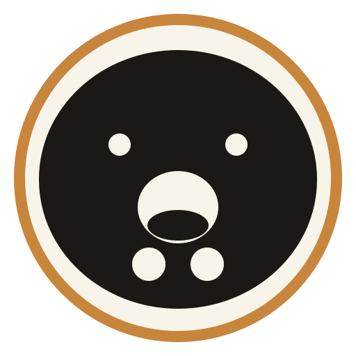

<div align="center">



# 🐼 Panda Wok

**Asian cloud kitchen · Alexandria, Egypt** — Wok · Ramen · Sushi · Izakaya, crafted to order.

</div>

A mobile-first cloud-kitchen platform for Panda Wok — an Asian kitchen in Alexandria, Egypt.
Next.js App Router + Supabase (Postgres, Auth, Storage, Realtime), deployed on Cloudflare.

> **Data safety rule (permanent).** Never delete rows from the live database and
> never mutate business data as a side effect of code work. Take content off the
> site with a flag (`is_enabled` / `is_available` / `is_published`), never with a
> `DELETE`. See `docs/data-safety.md`.
>
> **⛔ Menu database is off-limits (permanent).** Nobody — human or agent — writes
> to `categories`, `menu_items`, `menu_images`, `modifier_groups`,
> `modifier_options` or `upsell_rules` except the owner editing one dish at a time
> in `/admin`. No bulk re-import, no scripted price/name/image change, no delete.
> If a task looks like it needs a menu change, stop and ask the owner. The Chinese
> and Japanese catalogues are both public on `/menu` and neither is to be disabled.
> See `docs/data-safety.md`.

This is the operating system for the kitchen, not a landing page: customer ordering, kitchen
operations, CRM, loyalty, stock, feedback, messaging, analytics, and a provider-abstracted AI
layer all run on one schema with server-side validation and Row Level Security.

## Stack

| Layer | Choice |
| --- | --- |
| Framework | Next.js 16 (App Router, Server Components, Server Actions) |
| Language | TypeScript + Zod |
| UI | Tailwind CSS v4, Motion, lucide-react, Chart.js (`react-chartjs-2`) for admin charts |
| Backend | Supabase — PostgreSQL, Auth, Storage, Realtime |
| Deploy | Cloudflare Pages, Next compiled by `@opennextjs/cloudflare` |

## Getting started

```bash
npm install
cp .env.example .env.local   # fill in the Supabase + AI values
npm run dev
```

## Environment

All configuration is read from the environment — no business data is hard-coded in components.
See `.env.example` for the full list. `NEXT_PUBLIC_*` values are exposed to the browser by design;
everything else (service-role key, AI provider keys) stays server-side and is never shipped to the
client. The AI layer is provider-abstracted (OpenRouter / Cloudflare / Pollinations) and always
falls back to a deterministic, database-grounded answer when no provider is reachable.

## Database

Migrations live in `supabase/migrations/` and are the single source of truth. Apply them in order:

```bash
supabase db push          # or apply each file in the SQL editor
```

Key guarantees enforced in the database, not just the UI:

- prices, availability, stock and loyalty points are recomputed server-side on every order
- `orders` carries a unique `(user_id, idempotency_key)` so a double-tap cannot create two orders
- order status follows a state machine, and each transition is recorded in `order_status_history`
- cancelled/rejected/failed/refunded orders claw back redeemed loyalty points exactly once
- stock changes cascade to menu availability, but only for items in `auto` availability mode —
  admin-forced states (`forced_on` / `forced_off`) are never overridden by automation
- `profiles.email` is `citext` and phones are normalised to E.164, so duplicates cannot slip in
  through case or formatting differences

## SEO / AEO / GEO

Search and answer-engine visibility is treated as a product feature, generated from the live
database rather than hand-written per page:

| Surface | Where |
| --- | --- |
| `robots.txt` | `src/app/robots.txt/route.ts` — blocks admin/transactional routes, emits `Content-Signal` for AI crawlers |
| `sitemap.xml` | `src/app/sitemap.ts` — built from the live catalogue, so new dishes appear automatically |
| `llms.txt` | `src/app/llms-txt/route.ts`, rewritten to `/llms.txt` — the plain-text contract AI agents read |
| Structured data | `src/lib/seo/schema.ts` — Restaurant/LocalBusiness, Menu, MenuItem, Product, BreadcrumbList, WebSite, Organization, FAQPage |
| Metadata | `src/lib/seo/metadata.ts` — canonical, Open Graph, Twitter card, robots directives for every page |
| PWA | `public/manifest.webmanifest` + `src/app/icon.svg` |
| Headers / redirects | `public/_headers`, `public/_redirects` |

Structured data only emits facts the database actually holds — no invented address, hours, prices
or ratings. FAQ markup is only used where the page genuinely answers the question.

## Deploy to Cloudflare

Cloudflare's supported path for the App Router is the OpenNext adapter (the older `next-on-pages`
is Edge-only and breaks on Next 16). The adapter compiles the standalone Next build into a single
Worker on the `nodejs_compat` layer.

```bash
npm run preview   # build + run locally in workerd
npm run deploy    # build + deploy
```

Configuration: `wrangler.jsonc` (Worker entry, assets, compatibility flags) and `open-next.config.ts`.
`next.config.ts` must keep `output: "standalone"` — the adapter requires it.

Set the same environment variables in the Cloudflare dashboard (Workers → Settings → Variables) as
secrets. Never commit `.env.local`.
## Platform architecture

```text
Customer App (mobile-first)
   │
   ▼
Application / API layer  —  Server Components + Server Actions + route handlers
   │
   ▼
Business logic / services  —  src/lib/services, src/lib/orders, src/lib/ai, src/lib/crm…
   │
   ▼
Supabase              —  PostgreSQL (RLS), Auth, Storage, Realtime
        │
        ▼
Admin / CRM            —  same backend, role-based permissions, analytics
```

Every major capability is an independent module (domain folder under `src/lib/`) that can be
enabled, disabled, extended or replaced without breaking the rest:

| Module | Location | Highlights |
| --- | --- | --- |
| Menu/CMS | `src/lib/services/catalog.ts`, `admin-catalog.ts` | categories, items, images, upselling, slugs, stock-aware availability |
| Cart + orders | `src/lib/services/orders.ts`, `checkout-math.ts`, `order-workflow.ts`, `order-status.ts` | server-side price/stock validation, idempotency (unique `user_id+idempotency_key`), state machine |
| CRM | `src/lib/crm/` | customer segments, activity timeline, insights, loyalty |
| Loyalty | `src/lib/services/loyalty.ts` | points, levels/ladder, rewards, redemption, expiry, history |
| Stock | `src/lib/services/catalog.ts` + admin pages | ingredient quantities, thresholds, movements, cascade to availability (auto mode only) |
| Feedback | `src/app/(site)/feedback`, `src/lib/services/` | rating, category, order-link, admin triage/response/export |
| Team chat | `src/lib/services/team-chat.ts` | staff channels + DMs (`team_threads`), separate from customer chat |
| Customer chat | `src/lib/services/messaging.ts` | conversations, read/unread, staff identity, customer↔staff |
| Broadcast | `src/lib/services/messaging.ts` | targeted audiences, recipient estimation, confirmation gate |
| AI assistant | `src/lib/ai/assistant.ts` | Panda mascot UI → server action → DB-grounded answer |
| AI admin | `src/lib/ai/provider.ts`, `insights.ts` | DB-driven provider chain (Workers AI binding, OpenRouter, Gemini, deterministic), Vault secrets, quotas, usage ledger |
| Analytics | `src/app/api/analytics` | privacy-conscious funnel/events |
| Backups/exports | `src/lib/backup/`, `src/lib/export/` | server-side jobs, snapshots, CSV/JSON, restore docs |
| Charts | `src/components/charts/` | shared Chart.js set for the admin dashboard + analytics |
| SEO/AEO | `src/lib/seo/` + `src/app/{sitemap,llms-txt,robots.txt}` | dynamic metadata, schema.org JSON-LD, robots AEO allowlist, llms.txt |

> Note: earlier revisions of this table listed `src/lib/orders`, `loyalty`,
> `stock`, `messages` and `broadcast` as separate directories. They do not exist —
> the code is consolidated under `src/lib/services`, `src/lib/crm`, `src/lib/ai`,
> `src/lib/backup` and `src/lib/export`. The paths above are the real ones.

Admin UI lives under `src/app/admin/*` (guarded by middleware, non-indexable), customer app
under `src/app/(site)/*`. Server actions are the API layer for mutating flows; no service-role
key ever leaves the server.

## Production deploy (Cloudflare Pages)

The supported path is the OpenNext adapter plus a direct-upload Pages deployment.
`npm run pages:build` runs the OpenNext build and `scripts/build-pages.mjs`
assembles `.pages/` (the wrapper `_worker.js` serves static assets through the
`ASSETS` binding and falls through to the OpenNext handler). CI does exactly this
on a runner — `.github/workflows/deploy-pages.yml` builds and runs
`wrangler pages deploy .pages`.

```bash
npm run pages:deploy   # OpenNext build + assemble .pages/ + deploy
```

Pushing to the production branch (`feature/panda-wok-platform`, or
`main`/`production`) publishes via GitHub Actions. The repository secret
`CLOUDFLARE_API_TOKEN` is set, so push-to-deploy works; manual
`npm run pages:deploy` is the fallback.

Secrets on the Pages project (set once):
`NEXT_PUBLIC_SUPABASE_URL`, `NEXT_PUBLIC_SUPABASE_ANON_KEY`, `SUPABASE_URL`,
`SUPABASE_SERVICE_ROLE_KEY`, `NEXT_PUBLIC_SITE_URL`, plus optional AI keys.

Live: production → `https://panda-wok.pages.dev`. `NEXT_PUBLIC_SITE_URL` must be
that origin; it is inlined at build time and drives canonical/OG/sitemap URLs.

## Database schema

`supabase/migrations/` is the single source of truth. Core tables (verified live
2026-09-26, 53 tables): `profiles`, `staff`, `restaurants`, `categories`,
`menu_items`, `menu_images`, `modifier_groups`, `modifier_options`,
`menu_item_stock`, `orders`, `order_items`, `order_status_history`, `addresses`,
`feedback`, `conversations`, `messages`, `team_threads`, `team_thread_members`,
`team_messages`, `notifications`, `loyalty_accounts`, `loyalty_transactions`,
`loyalty_rewards`, `loyalty_redemptions`, `stock_items`, `stock_movements`,
`upsell_rules`, `offers`, `activity_logs`, `audit_logs`, `broadcasts`,
`broadcast_recipients`, `analytics_events`, `exports`, `backup_records`,
`ai_providers`, `ai_prompts`, `ai_knowledge_sources`, `ai_requests`,
`ai_usage_daily`, `ops_agent_settings`, `ops_agent_runs`, `ops_agent_actions`,
`agent_skills`, `agent_memory`, `page_content`, `faqs`, `delivery_zones`,
`announcements`, `page_seo`, `settings`, `feature_flags`.

Tenancy: domain tables carry `restaurant_id` FK → `restaurants(id)`; the singleton
`panda-wok` row is seeded idempotently and `current_restaurant_id()` mirrors the
app's resolver. Real multi-tenant isolation is a future redesign — today there is
one restaurant, so the tenant columns are populated but not session-derived.

## Scripts

| Command | Purpose |
| --- | --- |
| `npm run dev` | Next dev server |
| `npm run build` | Production Next build |
| `npm run lint` | ESLint |
| `npm run typecheck` | `tsc --noEmit` |
| `npm test` | Vitest (unit + live-row DB tests) |
| `npm run preview` | OpenNext build + local workerd preview |
| `npm run deploy` | OpenNext build + deploy to the Workers alias |
| `npm run pages:build` | OpenNext build + assemble `.pages/` for Pages |
| `npm run pages:deploy` | `pages:build` then `wrangler pages deploy .pages` |
| `npm run db:link` / `db:list` / `db:push` / `db:diff` | Supabase linked-project helpers |
| `npm run db:types` | Regenerate `src/lib/types/database.ts` from the live schema |
| `npm run icons` | Regenerate favicon / PWA icons from `public/panda-logo.svg` |
| `npm run fonts` | Rebuild the 928-byte `kana-mark.woff2` subset (中, 華) |
| `npm run skills:generate` | Regenerate the agent skills bundle from `skills.md` + `AGENTS.md` |
| `npm run cf-typegen` | Generate Cloudflare binding types |

